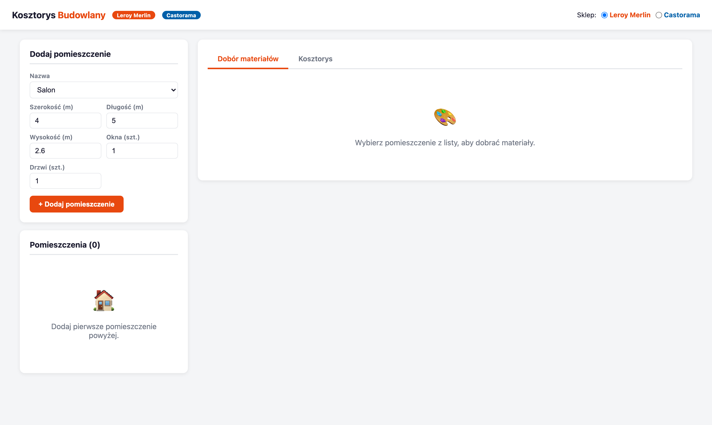
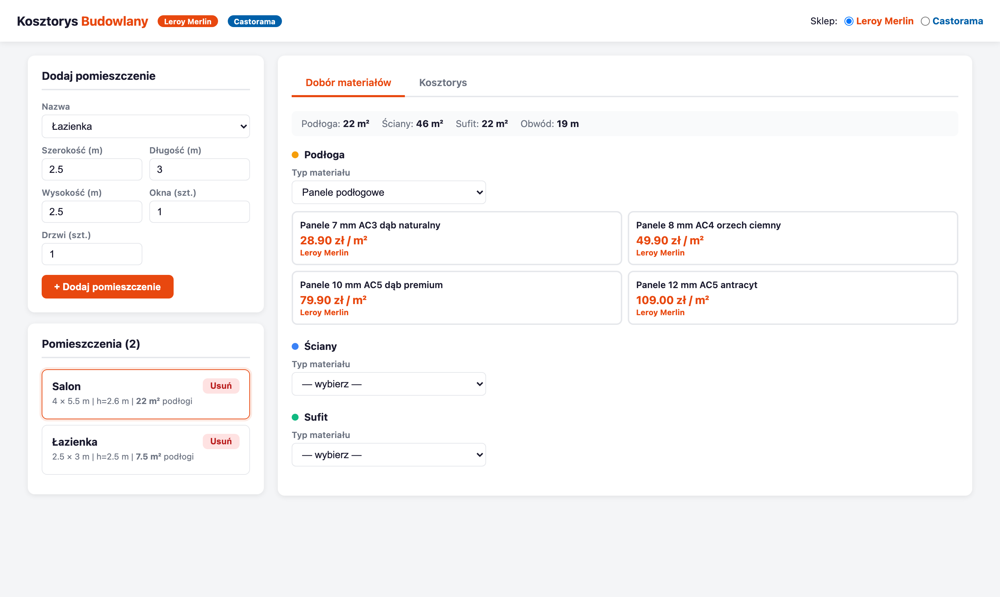
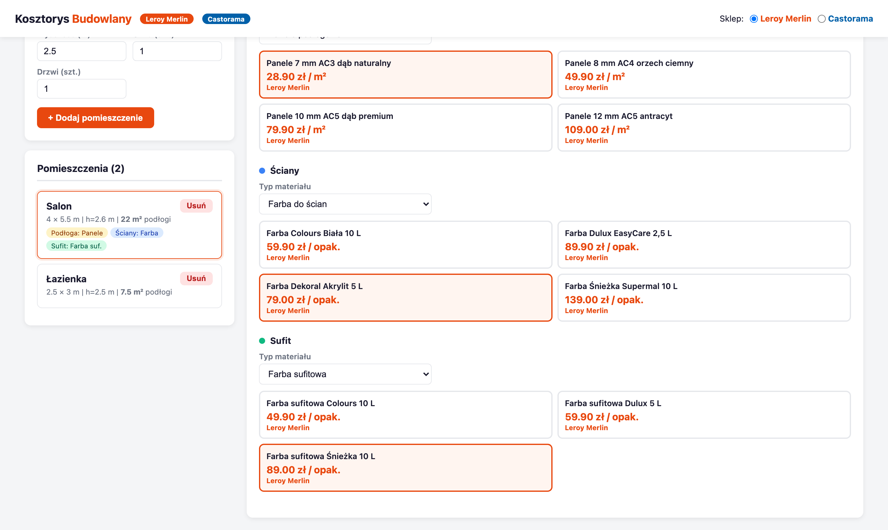
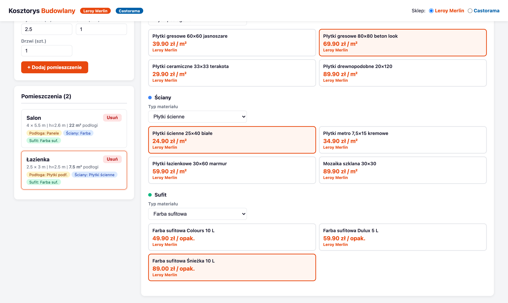
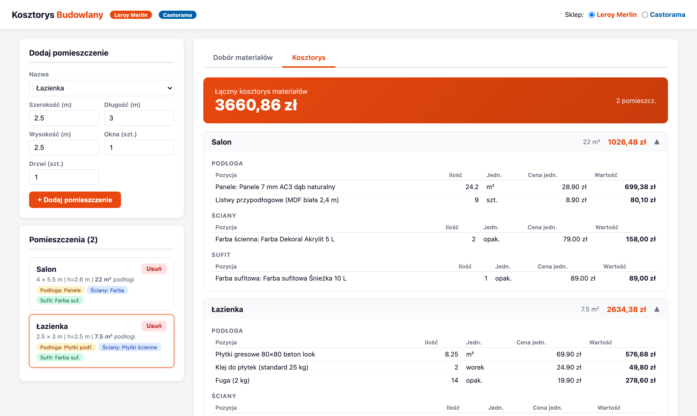
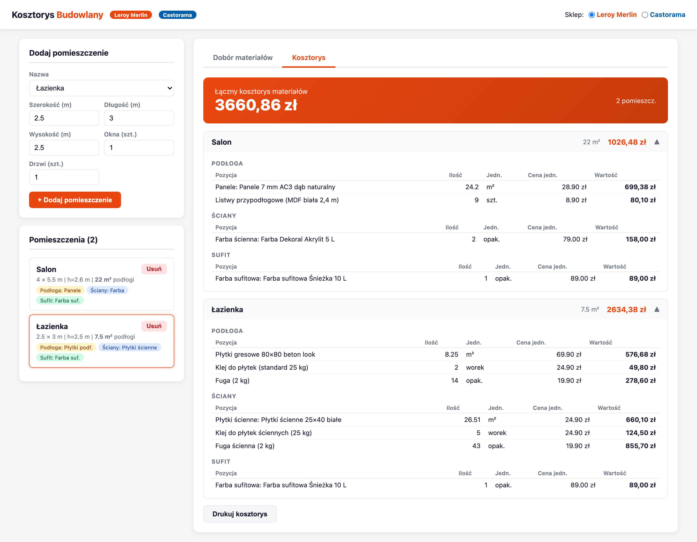
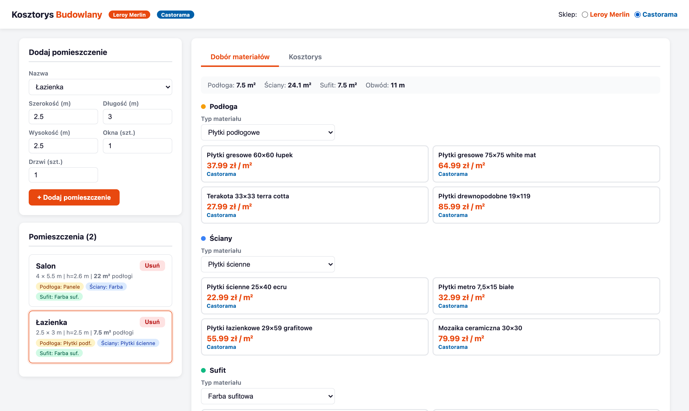

# Kosztorys Budowlany

Aplikacja webowa do szybkiego szacowania kosztów materiałów budowlanych i wykończeniowych. Pobiera ceny z polskich sklepów budowlanych — **Leroy Merlin** i **Castorama** — i wylicza szczegółowy kosztorys dla każdego pomieszczenia z uwzględnieniem odpadu materiałowego.

---

## Zrzuty ekranu

### Strona główna — formularz dodawania pomieszczeń


### Lista pomieszczeń i wybór materiałów na podłogę


### Kompletny dobór materiałów (podłoga, ściany, sufit)


### Łazienka — płytki podłogowe i ścienne


### Gotowy kosztorys z podziałem na pomieszczenia


### Pełny kosztorys — widok szczegółowy


### Przełącznik sklepu — Castorama


---

## Funkcjonalności

### Zarządzanie pomieszczeniami
- Dodawanie dowolnej liczby pomieszczeń: Salon, Sypialnia, Kuchnia, Łazienka, Korytarz, Gabinet, Pokój dziecięcy, Pralnia, Inne
- Dla każdego pomieszczenia: szerokość, długość, wysokość (w metrach), liczba okien i drzwi
- Automatyczne obliczanie powierzchni podłogi, ścian (z odjęciem okien i drzwi) oraz sufitu
- Edycja i usuwanie pomieszczeń w dowolnym momencie

### Dobór materiałów
| Powierzchnia | Dostępne materiały |
|---|---|
| **Podłoga** | Panele podłogowe, Płytki podłogowe, Wykładzina |
| **Ściany** | Farba do ścian, Tapeta, Płytki ścienne |
| **Sufit** | Farba sufitowa, Farba do ścian (biała) |

Dla każdej kategorii dostępnych jest kilka produktów w różnych przedziałach cenowych (budżetowy / standard / premium).

### Ceny z polskich sklepów budowlanych
- **Leroy Merlin** i **Castorama** — przełącznik w nagłówku aplikacji
- Scraper próbuje pobrać aktualne ceny ze stron sklepów (JSON-LD, `__NEXT_DATA__`, karty produktów HTML)
- Wyniki cachowane lokalnie przez **6 godzin** (plik `price_cache.json`)
- Przy braku połączenia lub niedostępności strony — automatyczny fallback do wbudowanej bazy domyślnych cen rynkowych

### Kalkulator materiałów
- Automatyczny **naddatek na odpad**: 10% dla paneli, płytek, wykładziny; 5% dla farb i klejów
- Panele podłogowe → automatycznie dodaje **listwy przypodłogowe**
- Płytki podłogowe → automatycznie dodaje **klej do płytek** (25 kg) i **fugę** (2 kg)
- Płytki ścienne → automatycznie dodaje **klej** i **fugę**
- Farba → oblicza litry na 2 warstwy, zaokrągla do pełnych opakowań
- Tapeta → oblicza liczbę rolek (zakłada rolkę 0,53×10 m = 5,3 m²)

### Kosztorys
- Podział na pomieszczenia, a w każdym — podłoga / ściany / sufit
- Tabela: pozycja, ilość, jednostka, cena jednostkowa, wartość
- Łączna suma dla każdego pomieszczenia i **suma całkowita**
- Możliwość zwijania/rozwijania sekcji pomieszczenia
- Przycisk **Drukuj kosztorys** (CSS `@media print` ukrywa zbędne elementy)

---

## Wymagania

- Python 3.10+
- pip

---

## Instalacja i uruchomienie

```bash
# 1. Sklonuj repozytorium
git clone https://github.com/DHrymajllo/Kosztorys-Budowlany.git
cd Kosztorys-Budowlany

# 2. Utwórz i aktywuj środowisko wirtualne
python3 -m venv .venv
source .venv/bin/activate        # macOS / Linux
# lub: .venv\Scripts\activate    # Windows

# 3. Zainstaluj zależności
pip install -r requirements.txt

# 4. Uruchom serwer
python3 app.py
```

Aplikacja będzie dostępna pod adresem: **http://localhost:5000**

> **Uwaga dla macOS**: jeśli port 5000 jest zajęty przez AirPlay Receiver,
> wyłącz go w *Ustawienia systemowe → AirDrop i Handoff → AirPlay Receiver*
> lub uruchom na innym porcie:
> ```bash
> flask --app app run --port 5001
> ```

---

## Struktura projektu

```
kosztorys-budowlany/
├── app.py               # Serwer Flask — routing i REST API
├── scraper.py           # Scraper cen + baza fallback (Leroy Merlin, Castorama)
├── calculator.py        # Kalkulator ilości materiałów i kosztów
├── requirements.txt     # Zależności Pythona
├── templates/
│   └── index.html       # Interfejs użytkownika (Vue.js 3, vanilla CSS)
└── docs/
    └── screenshots/     # Zrzuty ekranu aplikacji
```

---

## API (REST)

| Metoda | Endpoint | Opis |
|---|---|---|
| `GET` | `/` | Strona główna aplikacji |
| `GET` | `/api/prices/all` | Wszystkie ceny z bazy fallback (szybki start UI) |
| `GET` | `/api/prices/<kategoria>` | Ceny dla jednej kategorii (próba scrapingu) |
| `GET` | `/api/prices/<kategoria>?refresh=1` | Wymuś odświeżenie cache |
| `POST` | `/api/calculate` | Oblicz kosztorys — przyjmuje JSON z listą pomieszczeń |

### Przykład żądania do `/api/calculate`

```json
{
  "rooms": [
    {
      "name": "Salon",
      "width": 4.0,
      "length": 5.5,
      "height": 2.6,
      "windows": 2,
      "doors": 1,
      "floor_material": {
        "category": "panele_podlogowe",
        "product": { "name": "Panele 8 mm AC4 orzech ciemny", "price": 49.90, "unit": "m²" }
      },
      "wall_material": {
        "category": "farba_do_scian",
        "product": { "name": "Farba Colours Biała 10 L", "price": 59.90, "unit": "opak.", "coverage_m2_per_l": 10 }
      },
      "ceiling_material": {
        "category": "farba_sufitowa",
        "product": { "name": "Farba sufitowa Colours 10 L", "price": 49.90, "unit": "opak.", "coverage_m2_per_l": 10 }
      }
    }
  ]
}
```

---

## Dostępne kategorie materiałów

| Klucz | Nazwa |
|---|---|
| `panele_podlogowe` | Panele podłogowe |
| `plytki_podlogowe` | Płytki podłogowe |
| `plytki_scienne` | Płytki ścienne |
| `farba_do_scian` | Farba do ścian |
| `farba_sufitowa` | Farba sufitowa |
| `tapeta` | Tapeta |
| `klej_do_plytek` | Klej do płytek |
| `fuga` | Fuga |
| `listwy_przypodlogowe` | Listwy przypodłogowe |
| `wykładzina` | Wykładzina |

---

## Technologie

- **Backend**: Python 3, Flask, Requests, BeautifulSoup4
- **Frontend**: Vue.js 3 (Composition API, CDN), czysty CSS (bez frameworków)
- **Scraping**: requests + lxml + JSON-LD / `__NEXT_DATA__` parsing
